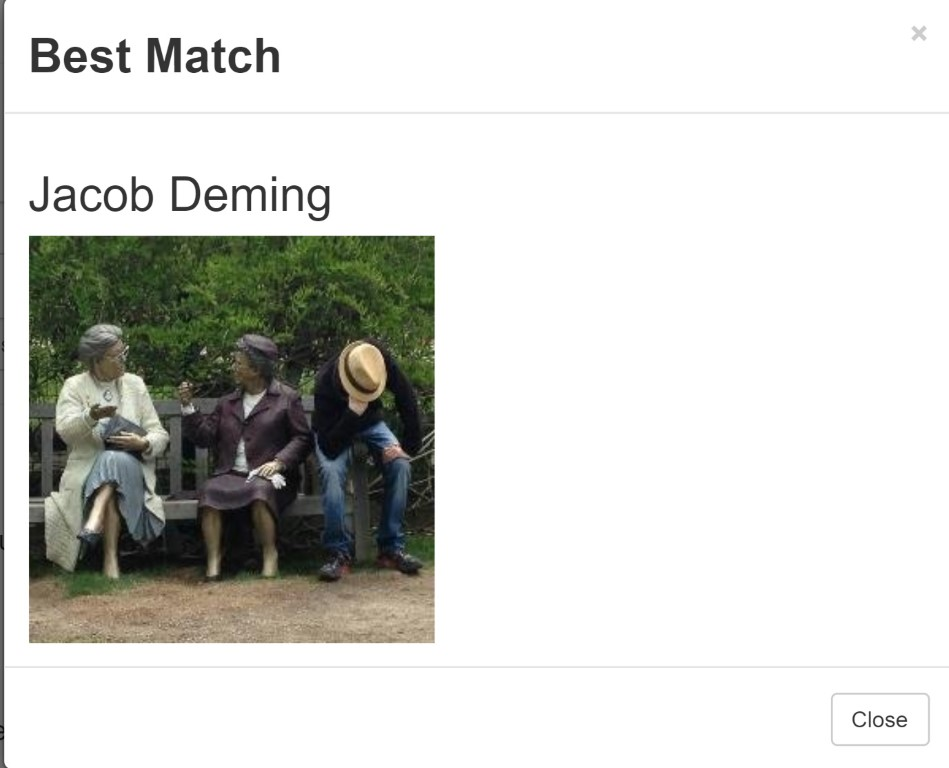
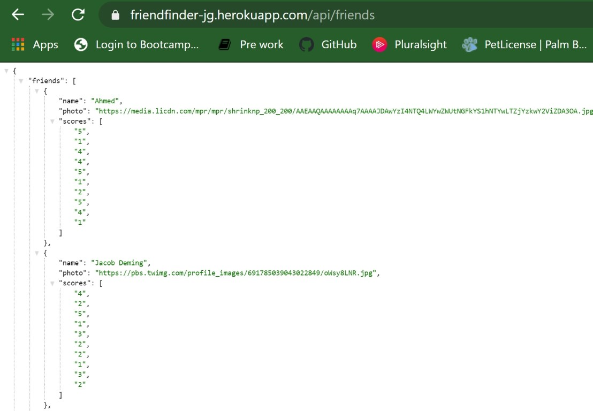

# FriendFinder
The friend finder app is a compatibility test based on a 10 question survey that the user will respond to. The answer to the questions range from 1 (strongly disagree) through 5 (strongly agree). Once the survey is submitted, a friend from the user data will pop up in a module based on the user's response by matching the scores.
 
* https://jcqlng.github.io/FriendFinder/
* https://friendfinder-jg.herokuapp.com/ 

## How to use 

### 1.The home page starts with a brief description of the app and a click button to start the survey.

### 2.You will then be redirected to the survey to answer all questions. 

### 3.Once the survey is complete, a friend will then pop up generated by the answers you give. 

### 4.To review the data saved and submitted click on API Friend list. 

# Dependencies 
1. Node 
2. Express

# Acknowledgment and Sources
* Basics on express - https://www.npmjs.com/package/express
* Clarification and examples of express - https://www.tutorialspoint.com/nodejs/nodejs_express_framework.htm
* Tutorial on creating the app - https://www.youtube.com/watch?v=kWu9stxD6m0 

